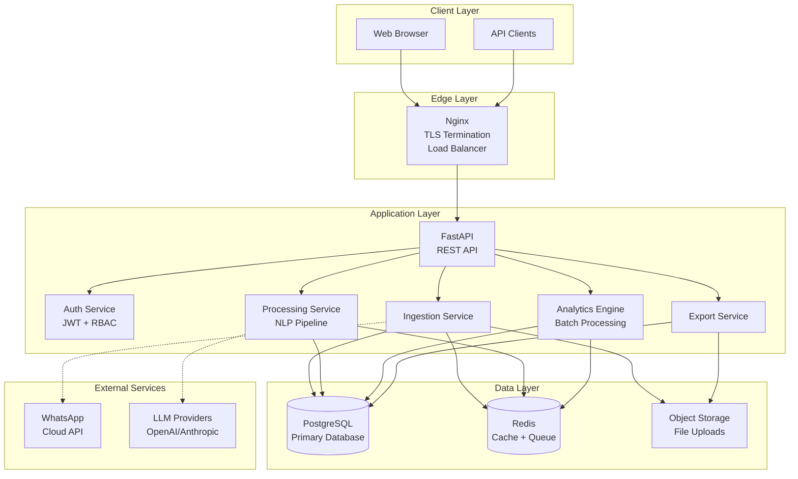

# WhatsApp Conversation Reader - Architecture Documentation

## Table of Contents

1. [System Overview](#system-overview)
2. [High-Level Architecture](#high-level-architecture)
3. [Database Schema](#database-schema)
4. [API Design](#api-design)
5. [Data Flow](#data-flow)
6. [Security & Privacy](#security--privacy)
7. [Scalability & Performance](#scalability--performance)
8. [Deployment Architecture](#deployment-architecture)
9. [Integration Points](#integration-points)

## System Overview

The WhatsApp Conversation Reader is a comprehensive application designed to ingest, process, analyze, and present WhatsApp conversation data in an enriched, searchable format. The system supports multiple deployment models and is designed with privacy, security, and performance as core principles.

### Key Components

- **Data Ingestion Service**: Handles file uploads and WhatsApp Cloud API bulk imports
- **Processing Pipeline**: NLP processing, data structuring, and analytics generation
- **API Gateway**: FastAPI-based REST API with authentication and rate limiting
- **Web Application**: React-based SPA for data visualization and interaction
- **Analytics Engine**: Batch processing system for generating insights
- **Storage Layer**: PostgreSQL for structured data, Redis for caching
- **Security Layer**: RBAC, audit logging, and GDPR compliance features

### Technology Stack

#### Backend
- **Language**: Python 3.12
- **Framework**: FastAPI (async support)
- **Data Processing**: pandas, spaCy, NLTK
- **Database**: PostgreSQL 15+
- **Cache**: Redis 7+
- **Message Queue**: Redis Streams
- **Web Server**: Nginx (reverse proxy, TLS termination)

#### Frontend
- **Framework**: React 18 with TypeScript
- **Build Tool**: Vite
- **UI Library**: Material-UI (MUI)
- **State Management**: Redux Toolkit
- **Data Visualization**: Recharts

#### Infrastructure
- **Containerization**: Docker, Docker Compose
- **Orchestration**: Kubernetes (Helm charts)
- **CI/CD**: GitHub Actions
- **Monitoring**: Prometheus + Grafana
- **Logging**: ELK Stack (Elasticsearch, Logstash, Kibana)

## High-Level Architecture

The system follows a microservices-oriented architecture with clear separation of concerns:

### Component Responsibilities

1. **Nginx**: Handles TLS termination, load balancing, and static file serving
2. **FastAPI**: Main API gateway, request routing, and response formatting
3. **Auth Service**: JWT token management, RBAC enforcement, session handling
4. **Ingestion Service**: File parsing, validation, and initial data structuring
5. **Processing Service**: NLP analysis, entity extraction, sentiment analysis
6. **Analytics Engine**: Batch job scheduling, metric calculation, report generation
7. **Export Service**: Format conversion, PDF generation, data packaging

## Performance Targets

- **Conversation Rendering**: < 3 seconds for 1-year history
- **Search/Filter**: < 250ms response time
- **File Size Support**: 100MB+ chat archives
- **Concurrent Users**: 20 sessions on 4 vCPU, 8GB RAM
- **Analytics Refresh**: 15-minute batch cycles