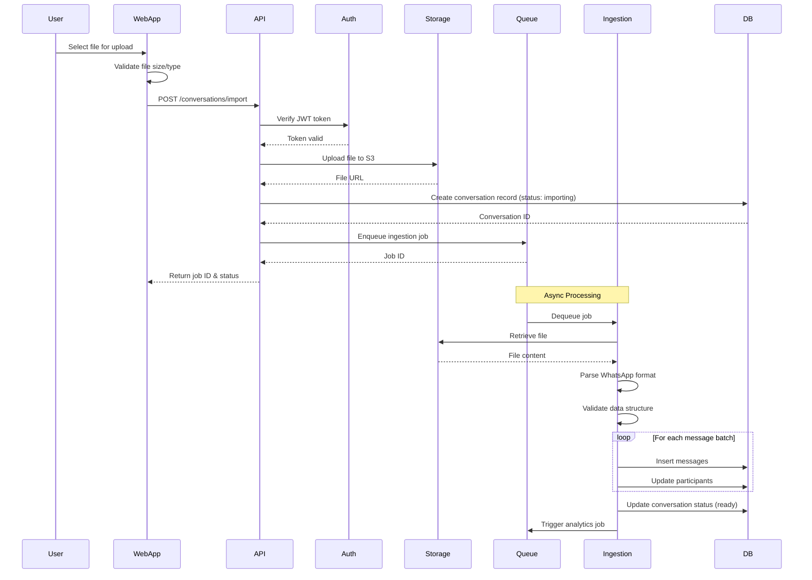
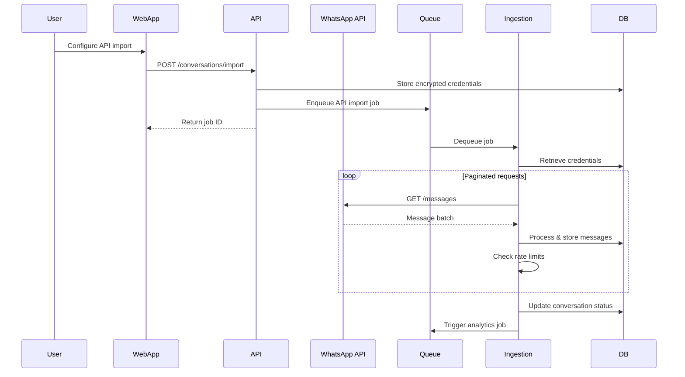
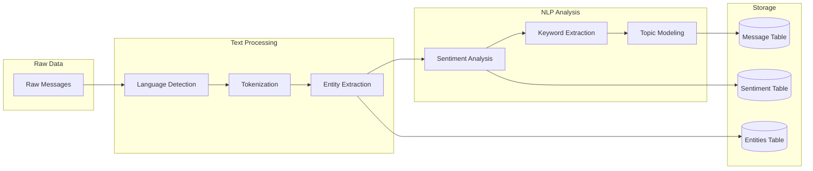
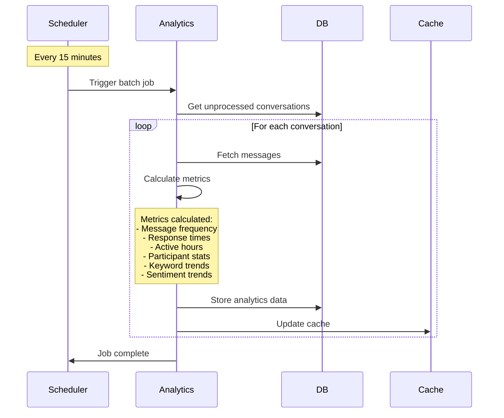
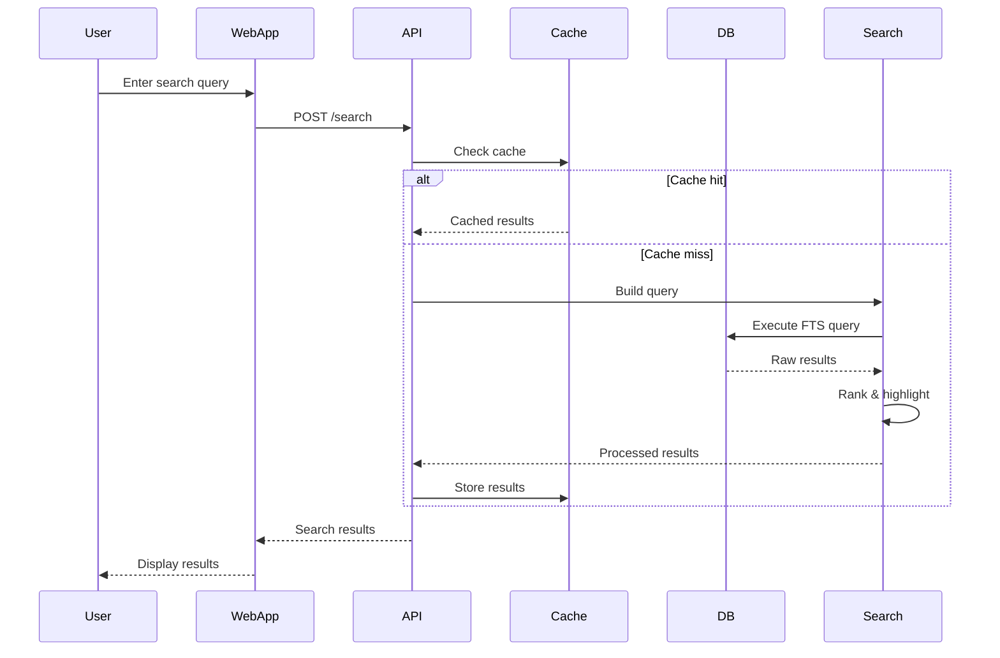
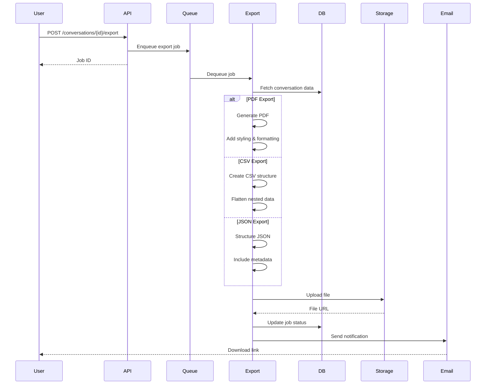
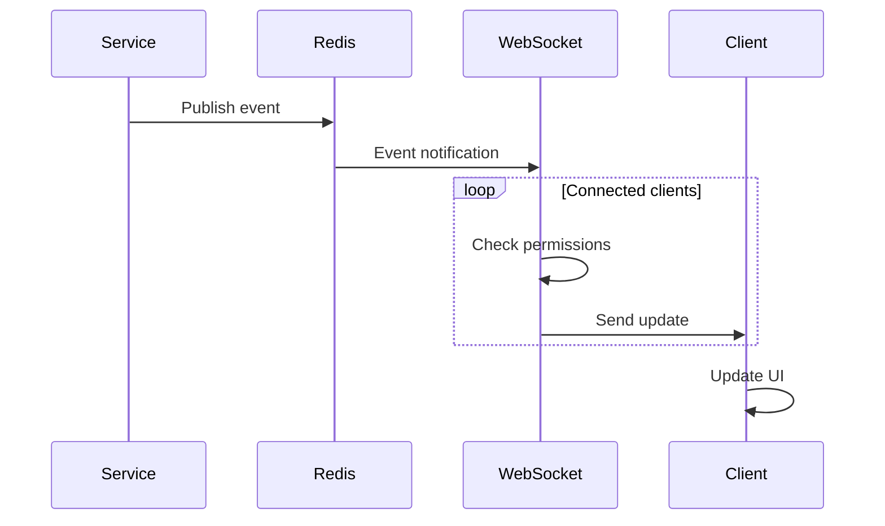

# Data Flow Documentation

## Overview

This document describes the data flow through the WhatsApp Conversation Reader system for key processes including data ingestion, processing, analytics generation, and export operations.

## 1. File Upload and Ingestion Flow



## 2. WhatsApp Cloud API Import Flow



## 3. Message Processing Pipeline



### Processing Steps Detail

1. **Language Detection**
   - Detect message language using langdetect
   - Store language code with message

2. **Tokenization**
   - Split text into tokens using spaCy
   - Handle emojis and special characters

3. **Entity Extraction**
   - Extract named entities (PERSON, ORG, LOCATION, DATE)
   - Extract phone numbers, emails, URLs
   - Store with position markers

4. **Sentiment Analysis**
   - Calculate polarity (-1 to 1)
   - Calculate subjectivity (0 to 1)
   - Classify emotion categories

5. **Keyword Extraction**
   - TF-IDF for important terms
   - N-gram analysis
   - Topic clustering

## 4. Analytics Generation Flow



### Analytics Metrics

1. **Temporal Patterns**
   - Messages per day/hour
   - Peak activity times
   - Conversation duration

2. **Participant Metrics**
   - Message count per participant
   - Average response time
   - Initiation frequency

3. **Content Analysis**
   - Top keywords/phrases
   - Topic distribution
   - Sentiment trends over time

4. **Interaction Patterns**
   - Conversation flow
   - Question-response pairs
   - Media sharing frequency

## 5. Search and Query Flow



## 6. Export Generation Flow



## 7. Real-time Update Flow (Future Enhancement)



## Data Security Considerations

### In-Transit Security
- TLS 1.3 for all API communications
- Certificate pinning for mobile apps
- Encrypted WebSocket connections

### At-Rest Security
- AES-256 encryption for file storage
- Encrypted database fields for sensitive data
- Key rotation every 90 days

### Processing Security
- Memory encryption for NLP processing
- Secure deletion of temporary files
- Audit logging for all data access

## Performance Optimizations

### Caching Strategy
```
1. Redis Cache Layers:
   - User session data (5 min TTL)
   - Search results (15 min TTL)
   - Analytics data (15 min TTL)
   - Conversation metadata (1 hour TTL)

2. Database Query Cache:
   - Prepared statements
   - Connection pooling
   - Read replicas for analytics
```

### Batch Processing
```
1. Message Ingestion:
   - 1000 messages per batch
   - Parallel processing (4 workers)
   - Backpressure handling

2. Analytics Generation:
   - Incremental updates
   - Materialized views
   - Partitioned tables
```

### Queue Management
```
1. Priority Queues:
   - High: User exports, search
   - Medium: Analytics updates
   - Low: Batch imports

2. Dead Letter Queue:
   - Failed job retry (3 attempts)
   - Error logging
   - Manual intervention alerts