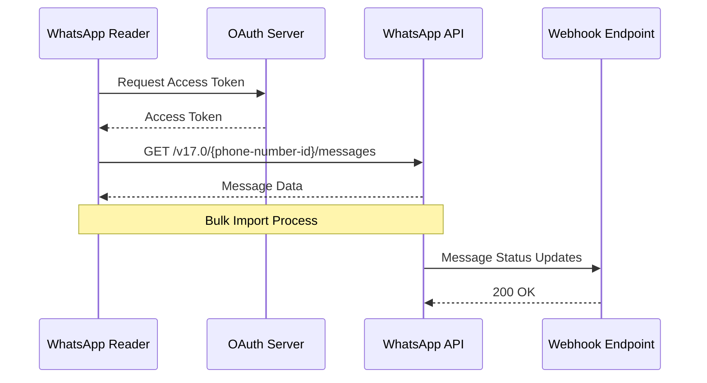

# Integration Points and External Dependencies

## Overview

This document outlines all external integrations, third-party dependencies, and API connections required by the WhatsApp Conversation Reader system.

## External Service Integrations

### 1. WhatsApp Business Cloud API



#### Configuration
```python
WHATSAPP_API_CONFIG = {
    "base_url": "https://graph.facebook.com/v17.0",
    "auth_url": "https://www.facebook.com/v17.0/dialog/oauth",
    "scopes": ["whatsapp_business_messaging", "whatsapp_business_management"],
    "rate_limits": {
        "calls_per_hour": 200000,
        "calls_per_minute": 4000
    },
    "webhook_verify_token": os.environ.get("WA_WEBHOOK_TOKEN"),
    "app_secret": os.environ.get("WA_APP_SECRET")
}
```

#### API Endpoints Used
- `GET /{phone-number-id}/messages` - Retrieve messages
- `GET /{message-id}` - Get message details
- `GET /{media-id}` - Download media files
- `POST /webhook` - Receive status updates

### 2. LLM Provider Integration (Provider-Agnostic)

```python
# Abstract LLM Interface
from abc import ABC, abstractmethod

class LLMProvider(ABC):
    @abstractmethod
    async def generate_summary(self, messages: List[str], options: dict) -> str:
        pass
    
    @abstractmethod
    async def analyze_sentiment(self, text: str) -> dict:
        pass

# OpenAI Implementation
class OpenAIProvider(LLMProvider):
    def __init__(self, api_key: str):
        self.client = OpenAI(api_key=api_key)
        self.model = "gpt-4-turbo-preview"
    
    async def generate_summary(self, messages: List[str], options: dict):
        prompt = self._build_summary_prompt(messages, options)
        response = await self.client.chat.completions.create(
            model=self.model,
            messages=[{"role": "system", "content": prompt}],
            max_tokens=options.get("max_tokens", 500)
        )
        return response.choices[0].message.content

# Anthropic Implementation
class AnthropicProvider(LLMProvider):
    def __init__(self, api_key: str):
        self.client = Anthropic(api_key=api_key)
        self.model = "claude-3-opus-20240229"
    
    async def generate_summary(self, messages: List[str], options: dict):
        prompt = self._build_summary_prompt(messages, options)
        response = await self.client.messages.create(
            model=self.model,
            messages=[{"role": "user", "content": prompt}],
            max_tokens=options.get("max_tokens", 500)
        )
        return response.content[0].text

# Factory Pattern for Provider Selection
class LLMProviderFactory:
    @staticmethod
    def create_provider(provider_name: str, api_key: str) -> LLMProvider:
        providers = {
            "openai": OpenAIProvider,
            "anthropic": AnthropicProvider,
            "azure": AzureOpenAIProvider,
            "local": LocalLLMProvider  # For self-hosted models
        }
        
        if provider_name not in providers:
            raise ValueError(f"Unknown provider: {provider_name}")
        
        return providers[provider_name](api_key)
```

### 3. Cloud Storage Integration

#### AWS S3 Configuration
```python
# S3 Client Configuration
S3_CONFIG = {
    "bucket_name": "whatsapp-reader-uploads",
    "region": "us-east-1",
    "storage_classes": {
        "hot": "STANDARD",
        "warm": "STANDARD_IA",
        "cold": "GLACIER"
    },
    "lifecycle_rules": [
        {
            "id": "archive-old-exports",
            "status": "Enabled",
            "transitions": [
                {"days": 30, "storage_class": "STANDARD_IA"},
                {"days": 90, "storage_class": "GLACIER"}
            ],
            "expiration": {"days": 365}
        }
    ]
}

# S3 Service Implementation
class S3Service:
    def __init__(self):
        self.client = boto3.client('s3')
        self.bucket = S3_CONFIG["bucket_name"]
    
    async def upload_file(self, file_path: str, key: str, metadata: dict = None):
        extra_args = {
            'ServerSideEncryption': 'AES256',
            'StorageClass': S3_CONFIG["storage_classes"]["hot"]
        }
        
        if metadata:
            extra_args['Metadata'] = metadata
        
        await self.client.upload_file(
            file_path, 
            self.bucket, 
            key,
            ExtraArgs=extra_args
        )
        
        return f"s3://{self.bucket}/{key}"
    
    async def generate_presigned_url(self, key: str, expiration: int = 3600):
        return self.client.generate_presigned_url(
            'get_object',
            Params={'Bucket': self.bucket, 'Key': key},
            ExpiresIn=expiration
        )
```

### 4. Authentication Providers

#### OAuth2 Integration
```yaml
oauth_providers:
  google:
    client_id: ${GOOGLE_CLIENT_ID}
    client_secret: ${GOOGLE_CLIENT_SECRET}
    authorize_url: https://accounts.google.com/o/oauth2/v2/auth
    token_url: https://oauth2.googleapis.com/token
    scopes:
      - openid
      - email
      - profile
  
  microsoft:
    client_id: ${AZURE_CLIENT_ID}
    client_secret: ${AZURE_CLIENT_SECRET}
    tenant_id: ${AZURE_TENANT_ID}
    authorize_url: https://login.microsoftonline.com/{tenant}/oauth2/v2.0/authorize
    token_url: https://login.microsoftonline.com/{tenant}/oauth2/v2.0/token
    scopes:
      - openid
      - email
      - profile
```

### 5. Email Service Integration

```python
# Email Service Configuration
EMAIL_CONFIG = {
    "provider": "sendgrid",  # or "ses", "smtp"
    "from_email": "noreply@whatsapp-reader.com",
    "templates": {
        "welcome": "d-1234567890abcdef",
        "export_ready": "d-0987654321fedcba",
        "password_reset": "d-abcdef1234567890"
    }
}

# SendGrid Implementation
class EmailService:
    def __init__(self):
        self.client = SendGridAPIClient(os.environ.get('SENDGRID_API_KEY'))
    
    async def send_export_notification(self, user_email: str, download_url: str):
        message = Mail(
            from_email=EMAIL_CONFIG["from_email"],
            to_emails=user_email
        )
        
        message.template_id = EMAIL_CONFIG["templates"]["export_ready"]
        message.dynamic_template_data = {
            "download_url": download_url,
            "expiry_time": "7 days"
        }
        
        response = await self.client.send(message)
        return response.status_code == 202
```

## Third-Party Libraries and Dependencies

### Backend Dependencies

```toml
# pyproject.toml
[tool.poetry.dependencies]
python = "^3.12"

# Web Framework
fastapi = "^0.109.0"
uvicorn = {extras = ["standard"], version = "^0.27.0"}
pydantic = "^2.5.0"

# Database
asyncpg = "^0.29.0"
sqlalchemy = {extras = ["asyncio"], version = "^2.0.25"}
alembic = "^1.13.1"

# Caching
redis = {extras = ["hiredis"], version = "^5.0.1"}
aiocache = "^0.12.2"

# Data Processing
pandas = "^2.1.4"
numpy = "^1.26.3"

# NLP
spacy = "^3.7.2"
nltk = "^3.8.1"
transformers = "^4.36.2"
langdetect = "^1.0.9"

# Task Queue
celery = {extras = ["redis"], version = "^5.3.4"}

# Cloud Services
boto3 = "^1.34.0"
google-cloud-storage = "^2.13.0"
azure-storage-blob = "^12.19.0"

# Authentication
python-jose = {extras = ["cryptography"], version = "^3.3.0"}
passlib = {extras = ["bcrypt"], version = "^1.7.4"}
python-multipart = "^0.0.6"

# API Clients
httpx = "^0.26.0"
openai = "^1.8.0"
anthropic = "^0.8.1"

# Monitoring
prometheus-client = "^0.19.0"
opentelemetry-api = "^1.22.0"
opentelemetry-sdk = "^1.22.0"
opentelemetry-instrumentation-fastapi = "^0.43b0"

# Testing
pytest = "^7.4.4"
pytest-asyncio = "^0.23.3"
pytest-cov = "^4.1.0"
factory-boy = "^3.3.0"
faker = "^22.0.0"

# Development
black = "^23.12.1"
ruff = "^0.1.11"
mypy = "^1.8.0"
pre-commit = "^3.6.0"
```

### Frontend Dependencies

```json
// package.json
{
  "dependencies": {
    "react": "^18.2.0",
    "react-dom": "^18.2.0",
    "react-router-dom": "^6.21.1",
    "@mui/material": "^5.15.3",
    "@mui/icons-material": "^5.15.3",
    "@emotion/react": "^11.11.3",
    "@emotion/styled": "^11.11.0",
    "@reduxjs/toolkit": "^2.0.1",
    "react-redux": "^9.0.4",
    "axios": "^1.6.5",
    "react-query": "^3.39.3",
    "recharts": "^2.10.4",
    "react-window": "^1.8.10",
    "date-fns": "^3.2.0",
    "react-hook-form": "^7.48.2",
    "react-dropzone": "^14.2.3",
    "socket.io-client": "^4.7.4"
  },
  "devDependencies": {
    "@types/react": "^18.2.47",
    "@types/react-dom": "^18.2.18",
    "@typescript-eslint/eslint-plugin": "^6.18.1",
    "@typescript-eslint/parser": "^6.18.1",
    "@vitejs/plugin-react": "^4.2.1",
    "eslint": "^8.56.0",
    "eslint-plugin-react-hooks": "^4.6.0",
    "prettier": "^3.1.1",
    "typescript": "^5.3.3",
    "vite": "^5.0.11",
    "vitest": "^1.1.3",
    "@testing-library/react": "^14.1.2",
    "@testing-library/jest-dom": "^6.2.0"
  }
}
```

## API Rate Limiting and Quotas

### External Service Limits

| Service | Rate Limit | Quota | Notes |
|---------|------------|-------|-------|
| WhatsApp Cloud API | 4,000/min | 200,000/hour | Per phone number |
| OpenAI GPT-4 | 10,000 tokens/min | 150,000 tokens/day | Tier 3 account |
| Anthropic Claude | 1,000 requests/min | 100,000 tokens/day | Pro tier |
| SendGrid | 100 emails/sec | 100,000/month | Pro plan |
| AWS S3 | 3,500 PUT/sec | Unlimited | Per prefix |
| Google OAuth | 20 requests/sec | Unlimited | Per client |

### Rate Limiting Implementation

```python
from asyncio import Semaphore
from functools import wraps
import time

class RateLimiter:
    def __init__(self, calls: int, period: int):
        self.calls = calls
        self.period = period
        self.semaphore = Semaphore(calls)
        self.call_times = []
    
    async def __aenter__(self):
        await self.semaphore.acquire()
        now = time.time()
        
        # Remove old calls outside the period
        self.call_times = [t for t in self.call_times if now - t < self.period]
        
        # If we're at the limit, wait
        if len(self.call_times) >= self.calls:
            sleep_time = self.period - (now - self.call_times[0])
            await asyncio.sleep(sleep_time)
        
        self.call_times.append(time.time())
    
    async def __aexit__(self, exc_type, exc_val, exc_tb):
        self.semaphore.release()

# Usage
whatsapp_limiter = RateLimiter(calls=4000, period=60)
openai_limiter = RateLimiter(calls=10000, period=60)

async def fetch_whatsapp_messages(phone_id: str):
    async with whatsapp_limiter:
        return await whatsapp_api.get_messages(phone_id)
```

## Webhook Integrations

### Incoming Webhooks

```python
# Webhook Handler
@app.post("/webhooks/whatsapp")
async def whatsapp_webhook(
    request: Request,
    background_tasks: BackgroundTasks
):
    # Verify webhook signature
    signature = request.headers.get("X-Hub-Signature-256")
    if not verify_webhook_signature(await request.body(), signature):
        raise HTTPException(status_code=401, detail="Invalid signature")
    
    # Process webhook data
    data = await request.json()
    
    # Handle different event types
    if data.get("entry"):
        for entry in data["entry"]:
            for change in entry.get("changes", []):
                if change["field"] == "messages":
                    background_tasks.add_task(
                        process_message_update,
                        change["value"]
                    )
    
    return {"status": "ok"}

def verify_webhook_signature(payload: bytes, signature: str) -> bool:
    expected = hmac.new(
        WHATSAPP_APP_SECRET.encode(),
        payload,
        hashlib.sha256
    ).hexdigest()
    
    return hmac.compare_digest(f"sha256={expected}", signature)
```

### Outgoing Webhooks

```python
# Webhook Notification Service
class WebhookService:
    def __init__(self):
        self.client = httpx.AsyncClient(timeout=30.0)
    
    async def notify_export_complete(self, webhook_url: str, export_data: dict):
        payload = {
            "event": "export.completed",
            "timestamp": datetime.utcnow().isoformat(),
            "data": export_data
        }
        
        # Sign the payload
        signature = self._generate_signature(payload)
        
        headers = {
            "Content-Type": "application/json",
            "X-Webhook-Signature": signature
        }
        
        try:
            response = await self.client.post(
                webhook_url,
                json=payload,
                headers=headers
            )
            response.raise_for_status()
        except httpx.HTTPError as e:
            logger.error(f"Webhook delivery failed: {e}")
            # Implement retry logic
            await self._schedule_retry(webhook_url, payload)
```

## CDN Integration

### CloudFront Configuration

```yaml
# CloudFront Distribution
distribution:
  enabled: true
  price_class: PriceClass_100
  
  origins:
    - id: S3-static-assets
      domain_name: whatsapp-reader-static.s3.amazonaws.com
      s3_origin_config:
        origin_access_identity: ${OAI_ID}
    
    - id: ALB-api
      domain_name: api-alb.whatsapp-reader.com
      custom_origin_config:
        http_port: 80
        https_port: 443
        protocol_policy: https-only
  
  default_cache_behavior:
    target_origin_id: S3-static-assets
    viewer_protocol_policy: redirect-to-https
    allowed_methods: [GET, HEAD]
    cached_methods: [GET, HEAD]
    compress: true
    
    cache_policy:
      default_ttl: 86400
      max_ttl: 31536000
      
  ordered_cache_behaviors:
    - path_pattern: /api/*
      target_origin_id: ALB-api
      viewer_protocol_policy: https-only
      allowed_methods: [GET, HEAD, OPTIONS, PUT, POST, PATCH, DELETE]
      cached_methods: [GET, HEAD]
      
      cache_policy:
        default_ttl: 0
        max_ttl: 0
```

## Monitoring and Observability Integrations

### Datadog Integration

```python
# Datadog APM Configuration
from ddtrace import patch_all, tracer

# Patch all supported libraries
patch_all()

# Configure tracer
tracer.configure(
    hostname=os.environ.get("DD_AGENT_HOST", "localhost"),
    port=int(os.environ.get("DD_TRACE_AGENT_PORT", 8126)),
    service="whatsapp-reader-api",
    env=os.environ.get("ENVIRONMENT", "development")
)

# Custom metrics
from datadog import initialize, statsd

initialize(
    api_key=os.environ.get("DD_API_KEY"),
    app_key=os.environ.get("DD_APP_KEY")
)

# Track custom metrics
statsd.increment('whatsapp.import.started')
statsd.histogram('whatsapp.import.duration', duration)
statsd.gauge('whatsapp.active_users', active_user_count)
```

### Sentry Error Tracking

```python
import sentry_sdk
from sentry_sdk.integrations.fastapi import FastApiIntegration
from sentry_sdk.integrations.sqlalchemy import SqlalchemyIntegration
from sentry_sdk.integrations.redis import RedisIntegration

sentry_sdk.init(
    dsn=os.environ.get("SENTRY_DSN"),
    environment=os.environ.get("ENVIRONMENT", "development"),
    integrations=[
        FastApiIntegration(transaction_style="endpoint"),
        SqlalchemyIntegration(),
        RedisIntegration(),
    ],
    traces_sample_rate=0.1,
    profiles_sample_rate=0.1,
)
```

## Security Integrations

### WAF Rules (AWS WAF)

```json
{
  "Rules": [
    {
      "Name": "RateLimitRule",
      "Priority": 1,
      "Statement": {
        "RateBasedStatement": {
          "Limit": 2000,
          "AggregateKeyType": "IP"
        }
      },
      "Action": {
        "Block": {}
      }
    },
    {
      "Name": "SQLInjectionRule",
      "Priority": 2,
      "Statement": {
        "ManagedRuleGroupStatement": {
          "VendorName": "AWS",
          "Name": "AWSManagedRulesSQLiRuleSet"
        }
      },
      "Action": {
        "Block": {}
      }
    }
  ]
}
```

### Secrets Management (HashiCorp Vault)

```python
import hvac

class VaultClient:
    def __init__(self):
        self.client = hvac.Client(
            url=os.environ.get("VAULT_ADDR"),
            token=os.environ.get("VAULT_TOKEN")
        )
    
    def get_secret(self, path: str) -> dict:
        response = self.client.secrets.kv.v2.read_secret_version(
            path=path,
            mount_point="secret"
        )
        return response["data"]["data"]
    
    def rotate_database_credentials(self):
        # Trigger credential rotation
        self.client.write(
            "database/rotate-root/postgres",
            {}
        )

# Usage
vault = VaultClient()
db_creds = vault.get_secret("database/postgres")
api_keys = vault.get_secret("external-apis/keys")
```

## Dependency Management

### Automated Updates

```yaml
# .github/dependabot.yml
version: 2
updates:
  - package-ecosystem: "pip"
    directory: "/backend"
    schedule:
      interval: "weekly"
    open-pull-requests-limit: 10
    
  - package-ecosystem: "npm"
    directory: "/frontend"
    schedule:
      interval: "weekly"
    open-pull-requests-limit: 10
    
  - package-ecosystem: "docker"
    directory: "/"
    schedule:
      interval: "weekly"
    
  - package-ecosystem: "github-actions"
    directory: "/"
    schedule:
      interval: "weekly"
```

### Security Scanning

```yaml
# .github/workflows/security.yml
name: Security Scan

on:
  push:
    branches: [main, develop]
  pull_request:
    branches: [main]

jobs:
  security:
    runs-on: ubuntu-latest
    steps:
    - uses: actions/checkout@v3
    
    - name: Run Trivy vulnerability scanner
      uses: aquasecurity/trivy-action@master
      with:
        scan-type: 'fs'
        scan-ref: '.'
        format: 'sarif'
        output: 'trivy-results.sarif'
    
    - name: Upload Trivy scan results
      uses: github/codeql-action/upload-sarif@v2
      with:
        sarif_file: 'trivy-results.sarif'
    
    - name: Run Snyk security scan
      uses: snyk/actions/python@master
      env:
        SNYK_TOKEN: ${{ secrets.SNYK_TOKEN }}
      with:
        args: --severity-threshold=high
```

## Integration Testing

### Mock Services for Testing

```python
# tests/mocks/external_services.py
class MockWhatsAppAPI:
    async def get_messages(self, phone_id: str, limit: int = 100):
        return {
            "messages": [
                {
                    "id": f"msg_{i}",
                    "from": "+1234567890",
                    "timestamp": "2024-01-01T00:00:00Z",
                    "text": {"body": f"Test message {i}"}
                }
                for i in range(limit)
            ],
            "paging": {
                "cursors": {
                    "before": "BEFORE_CURSOR",
                    "after": "AFTER_CURSOR"
                }
            }
        }

class MockLLMProvider:
    async def generate_summary(self, messages: List[str], options: dict):
        return "This is a mock summary of the conversation."
    
    async def analyze_sentiment(self, text: str):
        return {
            "sentiment": "positive",
            "confidence": 0.95,
            "scores": {
                "positive": 0.95,
                "negative": 0.03,
                "neutral": 0.02
            }
        }

# Integration test example
@pytest.mark.asyncio
async def test_whatsapp_import_flow(mock_whatsapp_api):
    service = ConversationImportService(api_client=mock_whatsapp_api)
    
    result = await service.import_conversation("+1234567890")
    
    assert result.status == "success"
    assert result.message_count == 100
    assert result.conversation_id is not None
```

## Disaster Recovery Integrations

### Multi-Region Failover

```yaml
# AWS Route 53 Health Checks
health_checks:
  primary:
    type: HTTPS
    resource_path: /health
    fqdn: api.whatsapp-reader.com
    port: 443
    request_interval: 30
    failure_threshold: 3
    
  secondary:
    type: HTTPS
    resource_path: /health
    fqdn: api-dr.whatsapp-reader.com
    port: 443
    request_interval: 30
    failure_threshold: 3

# Failover routing policy
routing_policy:
  type: failover
  primary:
    set_identifier: Primary
    failover: PRIMARY
    health_check_id: ${primary_health_check_id}
    
  secondary:
    set_identifier: Secondary
    failover: SECONDARY
    health_check_id: ${secondary_health_check_id}
```

This completes the comprehensive integration documentation for the WhatsApp Conversation Reader system.