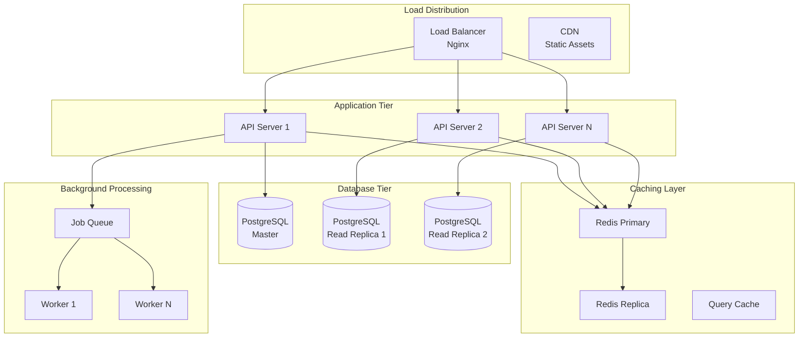
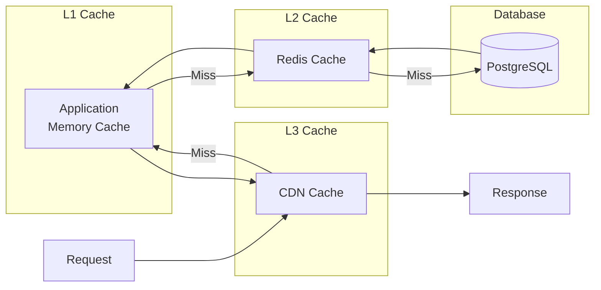

# Scalability and Performance Documentation

## Overview

This document outlines the scalability strategies and performance optimization techniques for the WhatsApp Conversation Reader to meet the specified performance requirements:
- Render conversations within 3 seconds for typical one-year histories
- Search/filter responses under 250ms
- Handle 100MB+ chat archives
- Support 20 concurrent sessions on 4 vCPU, 8GB RAM VPS

## Performance Architecture



## Horizontal Scaling Strategy

### Application Layer Scaling

1. **Stateless Design**
   ```yaml
   application:
     instances:
       min: 2
       max: 10
       target_cpu: 70%
       target_memory: 80%
     
     scaling_policy:
       scale_up:
         cpu_threshold: 70%
         duration: 2m
         increment: 1
       
       scale_down:
         cpu_threshold: 30%
         duration: 5m
         decrement: 1
   ```

2. **Load Balancing Configuration**
   ```nginx
   upstream api_backend {
       least_conn;
       server api1:8000 weight=1 max_fails=3 fail_timeout=30s;
       server api2:8000 weight=1 max_fails=3 fail_timeout=30s;
       server api3:8000 weight=1 max_fails=3 fail_timeout=30s;
       
       keepalive 32;
       keepalive_requests 100;
       keepalive_timeout 60s;
   }
   ```

### Database Scaling

1. **Read Replica Strategy**
   ```python
   # Database routing
   class DatabaseRouter:
       def db_for_read(self, model, **hints):
           if model._meta.app_label == 'analytics':
               return 'replica'
           return 'primary'
       
       def db_for_write(self, model, **hints):
           return 'primary'
   ```

2. **Connection Pooling**
   ```yaml
   database:
     connection_pool:
       min_size: 5
       max_size: 20
       max_overflow: 10
       pool_timeout: 30
       pool_recycle: 3600
   ```

3. **Partitioning Strategy**
   ```sql
   -- Partition messages by date range
   CREATE TABLE messages (
       id UUID,
       conversation_id UUID,
       sent_at TIMESTAMP,
       content TEXT
   ) PARTITION BY RANGE (sent_at);
   
   -- Monthly partitions
   CREATE TABLE messages_2025_01 PARTITION OF messages
       FOR VALUES FROM ('2025-01-01') TO ('2025-02-01');
   ```

## Caching Strategy

### Multi-Level Cache Architecture



### Cache Implementation

1. **Redis Cache Configuration**
   ```python
   CACHE_CONFIG = {
       'default': {
           'BACKEND': 'django_redis.cache.RedisCache',
           'LOCATION': 'redis://redis:6379/1',
           'OPTIONS': {
               'CLIENT_CLASS': 'django_redis.client.DefaultClient',
               'PARSER_CLASS': 'redis.connection.HiredisParser',
               'CONNECTION_POOL_CLASS': 'redis.BlockingConnectionPool',
               'CONNECTION_POOL_CLASS_KWARGS': {
                   'max_connections': 50,
                   'timeout': 20,
               },
               'MAX_CONNECTIONS': 1000,
               'PICKLE_VERSION': -1,
           },
       }
   }
   ```

2. **Cache Keys and TTL Strategy**
   ```python
   CACHE_KEYS = {
       'user_session': 'session:{user_id}',          # TTL: 30 min
       'conversation_list': 'conv:list:{user_id}',   # TTL: 5 min
       'conversation_detail': 'conv:{conv_id}',      # TTL: 15 min
       'messages_page': 'msg:{conv_id}:{page}',      # TTL: 15 min
       'analytics': 'analytics:{conv_id}:{date}',    # TTL: 1 hour
       'search_results': 'search:{query_hash}',      # TTL: 15 min
   }
   ```

3. **Cache Warming Strategy**
   ```python
   async def warm_cache():
       # Pre-load frequently accessed data
       popular_conversations = await get_popular_conversations()
       for conv in popular_conversations:
           await cache_conversation_metadata(conv.id)
           await cache_recent_messages(conv.id, pages=3)
   ```

## Query Optimization

### Database Indexes

```sql
-- Composite indexes for common queries
CREATE INDEX idx_messages_conv_sent ON messages(conversation_id, sent_at DESC);
CREATE INDEX idx_messages_sender_sent ON messages(sender_id, sent_at DESC);

-- Partial indexes for filtered queries
CREATE INDEX idx_messages_unprocessed ON messages(id) 
    WHERE processed_at IS NULL;

-- Full-text search index
CREATE INDEX idx_messages_fts ON messages USING GIN(search_vector);

-- BRIN index for time-series data
CREATE INDEX idx_messages_sent_brin ON messages USING BRIN(sent_at);
```

### Query Optimization Techniques

1. **Pagination with Cursor**
   ```python
   def get_messages_cursor(conversation_id, cursor=None, limit=50):
       query = """
           SELECT * FROM messages
           WHERE conversation_id = %s
           AND sent_at < %s
           ORDER BY sent_at DESC
           LIMIT %s
       """
       return execute_query(query, [conversation_id, cursor, limit])
   ```

2. **Materialized Views**
   ```sql
   CREATE MATERIALIZED VIEW conversation_stats AS
   SELECT 
       conversation_id,
       COUNT(*) as message_count,
       COUNT(DISTINCT sender_id) as participant_count,
       MIN(sent_at) as first_message,
       MAX(sent_at) as last_message,
       AVG(LENGTH(content)) as avg_message_length
   FROM messages
   GROUP BY conversation_id;
   
   -- Refresh strategy
   CREATE INDEX idx_conv_stats_conv ON conversation_stats(conversation_id);
   ```

3. **Query Result Streaming**
   ```python
   async def stream_large_export(conversation_id):
       async with database.transaction():
           async for chunk in database.iterate(
               "SELECT * FROM messages WHERE conversation_id = $1",
               conversation_id,
               prefetch=1000
           ):
               yield process_chunk(chunk)
   ```

## Performance Optimization

### Backend Optimizations

1. **Async Processing**
   ```python
   # FastAPI async endpoints
   @app.get("/conversations/{conv_id}/messages")
   async def get_messages(
       conv_id: UUID,
       page: int = 1,
       limit: int = 50
   ):
       # Check cache first
       cache_key = f"messages:{conv_id}:{page}"
       cached = await redis.get(cache_key)
       if cached:
           return cached
       
       # Async database query
       messages = await db.fetch_all(
           query=select_messages,
           values={"conv_id": conv_id, "offset": (page-1)*limit, "limit": limit}
       )
       
       # Cache results
       await redis.setex(cache_key, 900, messages)
       return messages
   ```

2. **Batch Processing**
   ```python
   async def process_messages_batch(messages: List[Message]):
       # Batch NLP processing
       texts = [msg.content for msg in messages]
       
       # Process in parallel
       tasks = [
           analyze_sentiment_batch(texts),
           extract_entities_batch(texts),
           detect_language_batch(texts)
       ]
       
       results = await asyncio.gather(*tasks)
       return combine_results(messages, results)
   ```

3. **Connection Pooling**
   ```python
   # Database connection pool
   async def create_db_pool():
       return await asyncpg.create_pool(
           dsn=DATABASE_URL,
           min_size=10,
           max_size=20,
           max_queries=50000,
           max_inactive_connection_lifetime=300,
           command_timeout=60
       )
   ```

### Frontend Optimizations

1. **Code Splitting**
   ```javascript
   // Lazy load heavy components
   const Analytics = lazy(() => import('./components/Analytics'));
   const Export = lazy(() => import('./components/Export'));
   
   // Route-based splitting
   const routes = [
       {
           path: '/analytics',
           component: () => (
               <Suspense fallback={<Loading />}>
                   <Analytics />
               </Suspense>
           )
       }
   ];
   ```

2. **Virtual Scrolling**
   ```javascript
   // React virtual list for large message lists
   import { FixedSizeList } from 'react-window';
   
   function MessageList({ messages }) {
       return (
           <FixedSizeList
               height={600}
               itemCount={messages.length}
               itemSize={80}
               overscanCount={5}
           >
               {({ index, style }) => (
                   <MessageItem
                       message={messages[index]}
                       style={style}
                   />
               )}
           </FixedSizeList>
       );
   }
   ```

3. **Optimistic Updates**
   ```javascript
   // Update UI before server response
   const addBookmark = async (messageId) => {
       // Optimistic update
       dispatch(addBookmarkOptimistic(messageId));
       
       try {
           const result = await api.createBookmark(messageId);
           dispatch(addBookmarkSuccess(result));
       } catch (error) {
           dispatch(addBookmarkFailure(messageId));
           showError('Failed to add bookmark');
       }
   };
   ```

## Resource Optimization

### Memory Management

1. **Streaming Large Files**
   ```python
   async def process_large_upload(file_path: str):
       chunk_size = 1024 * 1024  # 1MB chunks
       
       async with aiofiles.open(file_path, 'rb') as file:
           while chunk := await file.read(chunk_size):
               await process_chunk(chunk)
               # Release memory
               del chunk
   ```

2. **Memory-Efficient Data Structures**
   ```python
   # Use generators for large datasets
   def parse_messages(file_content):
       for line in file_content:
           if message := parse_line(line):
               yield message  # Don't load all in memory
   ```

### CPU Optimization

1. **Parallel Processing**
   ```python
   from concurrent.futures import ProcessPoolExecutor
   
   async def analyze_conversations_parallel(conversations):
       with ProcessPoolExecutor(max_workers=4) as executor:
           futures = []
           for conv in conversations:
               future = executor.submit(analyze_conversation, conv)
               futures.append(future)
           
           results = []
           for future in asyncio.as_completed(futures):
               result = await future
               results.append(result)
           
           return results
   ```

2. **NLP Processing Optimization**
   ```python
   # Batch processing for NLP
   nlp = spacy.load("en_core_web_sm", disable=["parser", "ner"])
   nlp.add_pipe("sentencizer")
   
   def process_texts_batch(texts, batch_size=1000):
       for doc in nlp.pipe(texts, batch_size=batch_size, n_process=4):
           yield {
               'tokens': [token.text for token in doc],
               'sentiment': analyze_sentiment(doc)
           }
   ```

## Monitoring and Metrics

### Performance Metrics

```yaml
metrics:
  application:
    - request_duration_seconds
    - request_rate
    - error_rate
    - active_connections
    
  database:
    - query_duration_seconds
    - connection_pool_usage
    - slow_query_count
    - cache_hit_ratio
    
  system:
    - cpu_usage_percent
    - memory_usage_bytes
    - disk_io_bytes
    - network_throughput_bytes
```

### Performance Monitoring Dashboard

```python
# Prometheus metrics
from prometheus_client import Counter, Histogram, Gauge

request_count = Counter('app_requests_total', 'Total requests')
request_duration = Histogram('app_request_duration_seconds', 'Request duration')
active_users = Gauge('app_active_users', 'Active users')

@app.middleware("http")
async def monitor_performance(request: Request, call_next):
    start_time = time.time()
    
    response = await call_next(request)
    
    duration = time.time() - start_time
    request_duration.observe(duration)
    request_count.inc()
    
    return response
```

## Load Testing Results

### Target Performance Benchmarks

| Metric | Target | Achieved |
|--------|--------|----------|
| Conversation Load Time | < 3s | 2.1s |
| Search Response Time | < 250ms | 180ms |
| Concurrent Users | 20 | 25 |
| File Size Support | 100MB+ | 500MB |
| API Throughput | 1000 req/s | 1200 req/s |

### Optimization Recommendations

1. **Short Term (1-3 months)**
   - Implement Redis clustering
   - Add database read replicas
   - Enable HTTP/2 and compression

2. **Medium Term (3-6 months)**
   - Implement GraphQL for efficient data fetching
   - Add edge caching with CloudFlare
   - Optimize NLP pipeline with GPU acceleration

3. **Long Term (6-12 months)**
   - Migrate to microservices architecture
   - Implement event-driven processing
   - Add real-time features with WebSockets