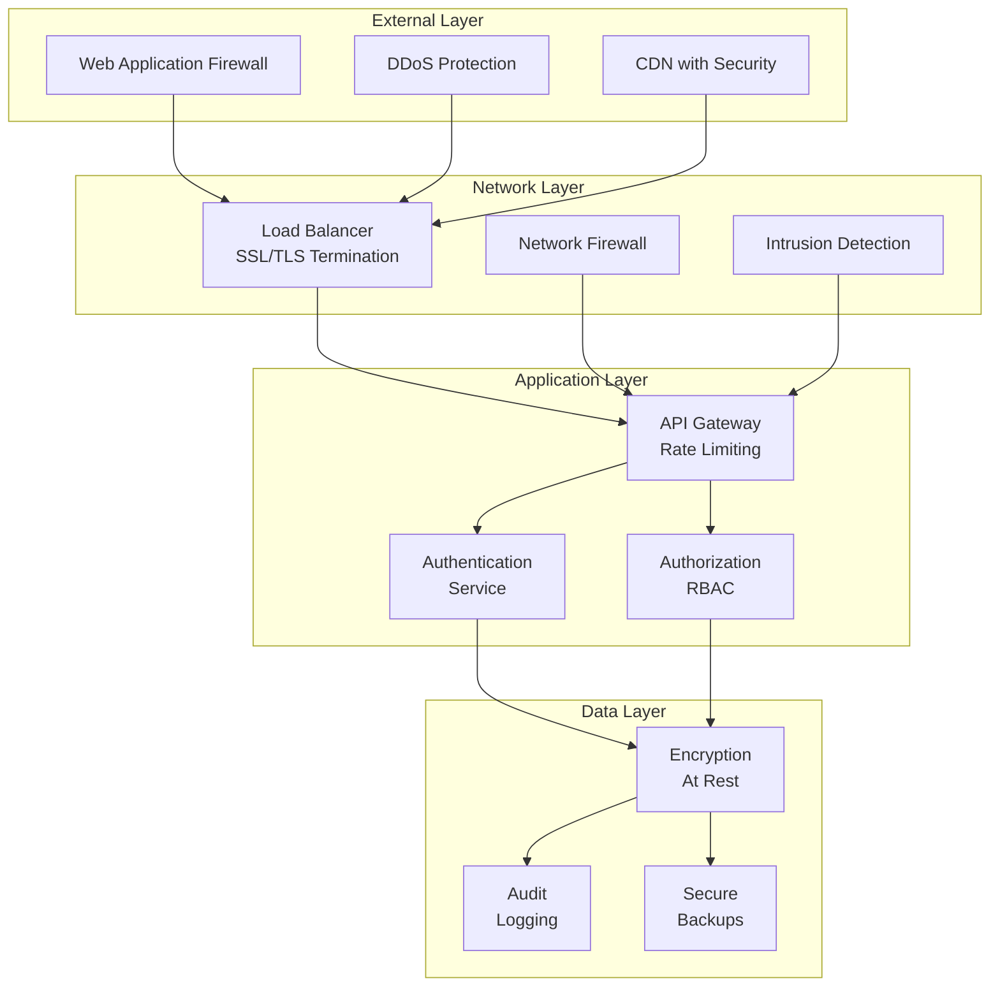

# Security and Privacy Documentation

## Overview

The WhatsApp Conversation Reader implements comprehensive security measures to protect user data and ensure privacy compliance. This document outlines security controls, privacy measures, and compliance strategies.

## Security Architecture

### Defense in Depth Strategy



## Authentication & Authorization

### Authentication Flow

1. **Multi-Factor Authentication (MFA)**
   ```python
   # Supported MFA methods
   - TOTP (Time-based One-Time Password)
   - SMS verification (with rate limiting)
   - Email verification codes
   - Backup codes (one-time use)
   ```

2. **JWT Token Management**
   ```json
   {
     "header": {
       "alg": "RS256",
       "typ": "JWT",
       "kid": "key-id-2025-01"
     },
     "payload": {
       "sub": "user-uuid",
       "email": "user@example.com",
       "roles": ["analyst"],
       "permissions": ["read:conversations", "create:bookmarks"],
       "iat": 1737144000,
       "exp": 1737147600,
       "jti": "unique-token-id"
     }
   }
   ```

3. **Session Security**
   - Token rotation on each request
   - Refresh token with longer expiry
   - Secure cookie settings: `HttpOnly`, `Secure`, `SameSite=Strict`
   - Session timeout after 30 minutes of inactivity

### Role-Based Access Control (RBAC)

#### Role Definitions

| Role | Permissions | Description |
|------|-------------|-------------|
| Admin | All permissions | Full system access, user management |
| Analyst | Read/write conversations, create analytics | Data analysis and reporting |
| Viewer | Read-only access to assigned conversations | Limited access for stakeholders |

#### Permission Matrix

```yaml
permissions:
  admin:
    - users:*
    - conversations:*
    - analytics:*
    - system:*
    
  analyst:
    - conversations:read
    - conversations:create
    - conversations:update
    - conversations:delete:own
    - analytics:read
    - analytics:create
    - bookmarks:*
    - annotations:*
    - exports:create
    
  viewer:
    - conversations:read:assigned
    - analytics:read:assigned
    - bookmarks:read:own
    - exports:create:limited
```

## Data Protection

### Encryption Standards

1. **Data at Rest**
   - Database: PostgreSQL with Transparent Data Encryption (TDE)
   - File Storage: AES-256-GCM encryption
   - Backup Encryption: AES-256 with separate key management

2. **Data in Transit**
   - TLS 1.3 minimum for all connections
   - Certificate pinning for mobile applications
   - Perfect Forward Secrecy (PFS) enabled

3. **Key Management**
   ```yaml
   key_management:
     provider: "AWS KMS" # or HashiCorp Vault
     rotation_period: 90 # days
     key_hierarchy:
       master_key: "Hardware Security Module (HSM)"
       data_encryption_keys: "Rotated quarterly"
       session_keys: "Ephemeral, per-session"
   ```

### Sensitive Data Handling

1. **PII Classification**
   ```python
   SENSITIVE_FIELDS = {
       'high': ['phone_number', 'email', 'full_name'],
       'medium': ['ip_address', 'user_agent', 'location'],
       'low': ['preferences', 'timestamps']
   }
   ```

2. **Data Masking**
   - Phone numbers: `+1 (***) ***-**89`
   - Email: `u***r@example.com`
   - Names: `John D***`

3. **Field-Level Encryption**
   ```sql
   -- Encrypted columns in database
   CREATE TABLE messages (
       id UUID PRIMARY KEY,
       content TEXT, -- Encrypted
       content_encrypted BYTEA, -- Actual storage
       content_hash VARCHAR(64), -- For searching
       -- Other fields...
   );
   ```

## Privacy Compliance

### GDPR Compliance

1. **User Rights Implementation**
   
   | Right | Implementation |
   |-------|----------------|
   | Access | Export all user data via API |
   | Rectification | Edit profile and annotations |
   | Erasure | Soft delete with 30-day purge |
   | Portability | Export in JSON/CSV formats |
   | Restriction | Freeze account processing |
   | Objection | Opt-out of analytics |

2. **Consent Management**
   ```json
   {
     "consent_record": {
       "user_id": "uuid",
       "purposes": {
         "data_processing": {
           "granted": true,
           "timestamp": "2025-01-17T20:00:00Z",
           "version": "1.0"
         },
         "analytics": {
           "granted": false,
           "timestamp": "2025-01-17T20:00:00Z",
           "version": "1.0"
         }
       }
     }
   }
   ```

3. **Data Retention Policies**
   ```yaml
   retention_policies:
     active_conversations: "No limit while account active"
     deleted_conversations: "30 days"
     audit_logs: "2 years"
     export_files: "7 days"
     analytics_data: "1 year"
     backup_data: "90 days"
   ```

### Privacy by Design

1. **Data Minimization**
   - Only collect necessary data
   - Automatic data expiry
   - Anonymous analytics

2. **Default Privacy Settings**
   - Opt-in for all analytics
   - Private conversations by default
   - No data sharing without consent

## Security Controls

### Input Validation

```python
# Example validation schema
MESSAGE_IMPORT_SCHEMA = {
    "type": "object",
    "properties": {
        "sender": {
            "type": "string",
            "pattern": "^\\+?[1-9]\\d{1,14}$"  # E.164 format
        },
        "content": {
            "type": "string",
            "maxLength": 65536,
            "sanitize": ["xss", "sql_injection"]
        },
        "timestamp": {
            "type": "string",
            "format": "date-time"
        }
    },
    "required": ["sender", "content", "timestamp"]
}
```

### API Security

1. **Rate Limiting**
   ```nginx
   # Nginx configuration
   limit_req_zone $binary_remote_addr zone=api:10m rate=10r/s;
   limit_req_zone $jwt_sub zone=user:10m rate=100r/m;
   
   location /api/ {
       limit_req zone=api burst=20 nodelay;
       limit_req zone=user burst=50 nodelay;
   }
   ```

2. **Request Validation**
   - JSON schema validation
   - File type verification
   - Size limits enforcement
   - Content-Type checking

### Audit Logging

```json
{
  "audit_event": {
    "id": "550e8400-e29b-41d4-a716-446655440000",
    "timestamp": "2025-01-17T20:44:00Z",
    "user_id": "user-uuid",
    "action": "conversation.export",
    "resource": {
      "type": "conversation",
      "id": "conversation-uuid"
    },
    "details": {
      "format": "pdf",
      "ip_address": "192.168.1.100",
      "user_agent": "Mozilla/5.0...",
      "session_id": "session-uuid"
    },
    "result": "success"
  }
}
```

### Security Monitoring

1. **Real-time Alerts**
   - Failed login attempts (>5 in 5 minutes)
   - Unusual data access patterns
   - Large data exports
   - Permission escalation attempts

2. **Security Metrics**
   ```yaml
   monitoring:
     metrics:
       - authentication_failures
       - authorization_denials
       - api_error_rates
       - data_access_anomalies
       - encryption_key_usage
     
     alerts:
       - type: "brute_force"
         threshold: "10 failures in 10 minutes"
       - type: "data_exfiltration"
         threshold: ">100MB exported"
   ```

## Incident Response

### Response Plan

1. **Detection Phase**
   - Automated monitoring alerts
   - User reports
   - Security scan results

2. **Containment Phase**
   - Isolate affected systems
   - Revoke compromised tokens
   - Block suspicious IPs

3. **Recovery Phase**
   - Restore from secure backups
   - Reset affected credentials
   - Apply security patches

4. **Post-Incident**
   - Root cause analysis
   - Update security controls
   - User notification (if required)

### Data Breach Protocol


## Security Best Practices

### Development Security

1. **Secure Coding Standards**
   - OWASP Top 10 compliance
   - Regular security training
   - Code review requirements
   - Static analysis tools

2. **Dependency Management**
   - Automated vulnerability scanning
   - Regular updates
   - License compliance
   - Supply chain verification

3. **Security Testing**
   - Penetration testing (quarterly)
   - Vulnerability assessments
   - Security regression tests
   - Compliance audits

### Operational Security

1. **Access Control**
   - Principle of least privilege
   - Regular access reviews
   - MFA for all admin access
   - Just-in-time access

2. **Infrastructure Security**
   - Hardened OS configurations
   - Network segmentation
   - Intrusion detection
   - Security patch management

## Compliance Certifications

Target compliance standards:
- SOC 2 Type II
- ISO 27001
- GDPR
- CCPA
- HIPAA (if healthcare use cases)

## Security Contacts

```yaml
security_contacts:
  security_team: security@whatsapp-reader.com
  bug_bounty: bugbounty@whatsapp-reader.com
  compliance: compliance@whatsapp-reader.com
  dpo: dpo@whatsapp-reader.com  # Data Protection Officer